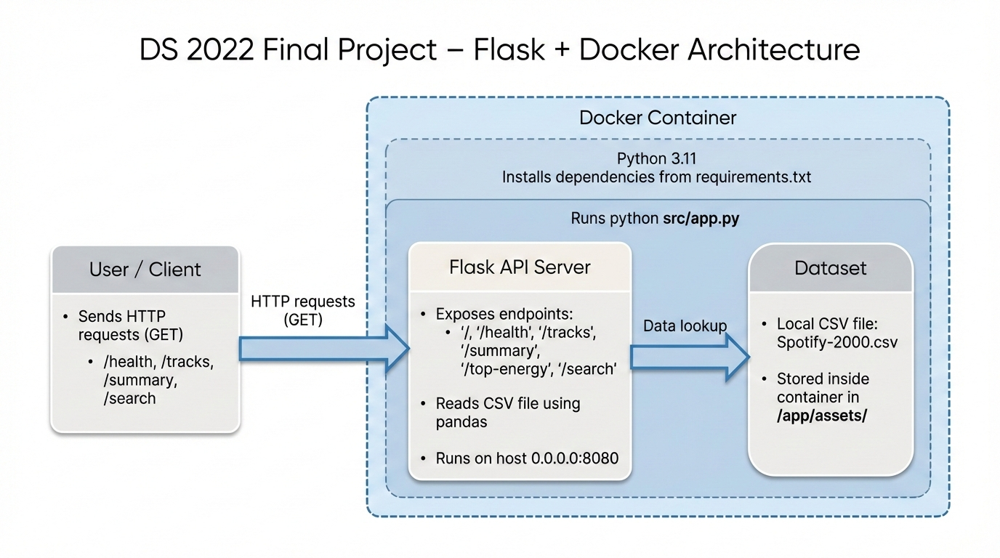

# Spotify 2000s Track Explorer API
A containerized Flask API that lets users explore and analyze 2000s Spotify track data using simple HTTP endpoints

## 1) Executive Summary

**Problem:**  
Exploring raw CSV datasets of Spotify tracks from the 2000s is tedious and inefficient for music analysts or hobbyists. Users must manually filter, sort, and compute statistics, which can be error-prone and time-consuming.

**Solution:**  
This project provides a **Flask-based API** that exposes endpoints to query, filter, and analyze Spotify track data programmatically. Users can retrieve top-energy tracks, search by artist or title, and obtain summary statistics through simple HTTP requests. The API is containerized with Docker for easy deployment and reproducibility.

---

## 2) System Overview

**Course Concept(s) Used:**  
- **Flask API**: Built REST endpoints to interact with tabular data.  
- **Pandas**: Data processing and aggregation from CSV files.  

**Architecture Diagram:**  
 


**Project Structure**

```text
DS2022-Final-Project/
├── .github/                # CI/CD workflows
│   └── workflows/
│       └── ci.yml
├── src/                    # Application / library 
│   ├── app.py              # Main Flask API
├── assets/                 # Diagrams, screenshots, images
│   ├── Final-Project-Diagram.png
│   └── Spotify-2000.csv        # Dataset (seed/test data)
├── tests/                  # Smoke/unit tests
│   └── smoke_test.sh
├── Dockerfile              # Docker container instructions
├── requirements.txt        # Python dependencies
├── .env.example            # Example environment variables (no secrets)
├── run.sh                  # Optional one-line launcher
├── README.md               # Project write-up
└── LICENSE                 # MIT license for code
```


**Data/Models/Services:**  
| Component | Source | Size | Format | License |
|-----------|--------|------|--------|---------|
| Spotify 2000s Track Dataset | Kaggle: [Spotify Top 2000s Mega Dataset](https://www.kaggle.com/datasets/iamsumat/spotify-top-2000s-mega-dataset) | ~1k tracks | CSV | Kaggle license |

---

## 3) How to Run (Docker)

### Docker

```bash
# Build Docker image
docker build -t spotify-api:latest .
```
```bash
# Run container
docker run --rm -p 8080:8080 --env-file .env.example spotify-api:latest
```
```bash
# Test API health
curl http://127.0.0.1:8080/api/health
```
Test API endpoints:  

Health check: 
```bash
curl http://127.0.0.1:8080/api/health 
```
Top 10 energy tracks: 
```bash
curl "http://127.0.0.1:8080/api/top-energy"
```
Search tracks by artist: 
```bash
curl "http://127.0.0.1:8080/api/search?q=coldplay"
```
Search tracks by title: 
```bash
curl "http://127.0.0.1:8080/api/search?q=yellow"
```

---

## 4) Design Decisions

Why Flask?  
Flask is lightweight, flexible, and integrates seamlessly with pandas. Alternatives like FastAPI or Django were considered, but Flask provided simplicity and faster setup for this dataset.

Trade-offs:  
Performance: Pandas works well for ~1k records but may slow on larger datasets.  
Complexity: Lightweight API reduces overhead but does not include full authentication or caching.  
Maintainability: Modular code allows easy expansion (e.g., adding new endpoints).

Security/Privacy:  
No sensitive data is stored.  
Input validation ensures API queries do not crash the server.  
.env.example provided; no secrets committed.

Ops Considerations:  
Logging handled via Flask default logging.  
Docker container ensures deterministic builds.  
Scaling to larger datasets would require database integration and caching.

---

## 5) Results & Evaluation

Sample Output: 
```text
[
  {"title":"Song A","artist":"Artist X","energy":0.95,"danceability":0.80},  
  {"title":"Song B","artist":"Artist Y","energy":0.92,"danceability":0.75}  
]
```

Validation / Tests:  
tests/smoke_test.sh contains simple curl-based tests for endpoints.  
Confirms correct JSON structure and response codes.
**CI/CD Pipeline**: GitHub Actions workflow (`.github/workflows/ci.yml`) automatically builds the Docker image and runs smoke tests on every push to `main`.


## 6) What’s Next

In future iterations, I can expand the API in several ways:

### 1. Scale to Larger Datasets
- Migrate from CSV to a database backend such as PostgreSQL or MongoDB.  
- Add indexing to support faster search queries.  

### 2. Add Authentication and User Management
- Implement API key or JWT authentication.  
- Role-based access (e.g., admin vs read-only users).  

### 3. Enhanced Analytics Endpoints 
- Advanced filtering (e.g., energy > 0.8 AND danceability > 0.7).  
- Artist-level summaries (average tempo, tempo variance, etc.).

### 4. Optional UI Layer
- A lightweight React frontend to visualize results and analytics.  
- Interactive plots for tempo, energy, key distribution, etc.

### 5. Deployment & Ops Improvements
- Enable horizontal scaling via Azure Container Apps revisions.  
- Expand CI/CD to include automated deployment in addition to testing.


---

## 7) Links

GitHub Repo: https://github.com/wilsonfredbeck7/DS2022-Final-Project  
Public Cloud App (optional): https://ds2022-final-project.proudmoss-faed8c29.westus3.azurecontainerapps.io

License: MIT (see LICENSE file)  
Dataset Attribution: Spotify Top 2000s Mega Dataset, [Kaggle](https://www.kaggle.com/datasets/iamsumat/spotify-top-2000s-mega-dataset)